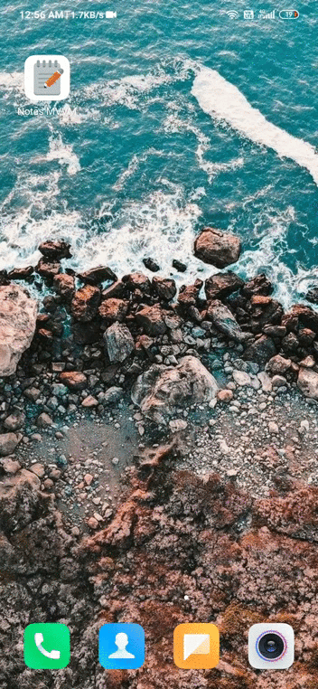

# Notes-MVVM

 
This is a simple Notetaking application built completely on MVVM achitecture. Model–view–viewmodel is a software architectural pattern that facilitates the separation of the development of the graphical user interfacefrom the development of the business logic or back-end logic so that the view is not dependent on any specific model platform.

### 1. Working - 

 

### 2. Architecture - 

 

 

### 3. Description -

- #### 1. Note Entity:
Here we define structure of our Note table- column names, constructor to add value in table and getter methods to retrieve data.

- #### 2. Note DAO -  
DAO (Data Access Object) - define all database operation that we want to make on Note Entity / Table. DAO can be abstract class or interface - Only defining, no method body - Room will automatically generate necessary code, we just annotate the methods of what they are supposed to do.

- #### 3. Note Database -
We have our Note Entity and Note Dao, we create another class - NoteDatabase which will connect both of them and create actual instance of database. This is called ROOM DATABASE containing both Entity and its DAO.
This class is going to be a Singleton class - can't create multiple instance of NoteDatabase class - use same instance everywhere.

- #### 4. Note Repository -
Not a part of Android Architecture Components but Provides an extra abstraction between different data sources and rest of app. Repository uses DAO methods (from NoteDao) to retrieve all the entries from Note table as a list wrapped into Live Data. The same Live Data is given to ViewModel by repository and saves it for Main Activity. Main Activity doesn't store data itself but it observes LiveData stored in ViewModel and automatically receives updated list of notes whenever data in corresponding SQLite table changes.

- #### 5. Note ViewModel - 
ViewModel is a part of android architecture components library. It's job is to store and process data for user interface and communicate with the model. It request data from Repository so that Activity can draw data on screen and it forwards user interaction from UI back to repository.
It is recommended to put UI related data into viewModel instead of UI Controller(UI - Activity/Fragment), bcz ViewModel survive configuration changes.(Screen Rotation, Language Change- Activity is destroyed and recreated, state of member variables is lost). View Model keeps that data and new activity gets same ViewModel instance and can immediately access same variable.
ViewModel is only removed from memory when lifecycle of activity/fragment is over(Activity is finished or fragment is detached).

 
 

### 4. Features -
- Add Note
- Delete Note - Swipe
- Edit Note

 
 
Credits- [CodingInFlow](https://www.youtube.com/channel/UC_Fh8kvtkVPkeihBs42jGcA)
